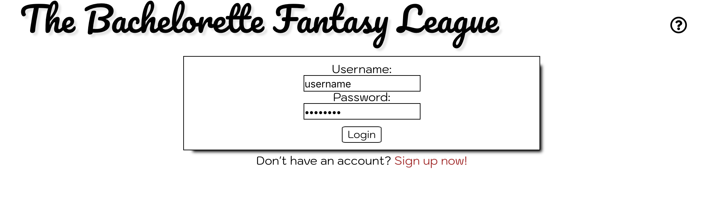
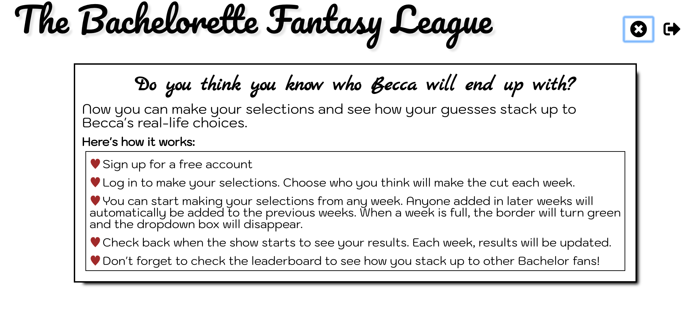
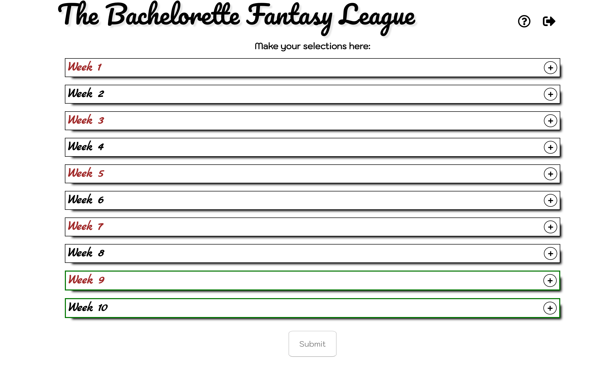
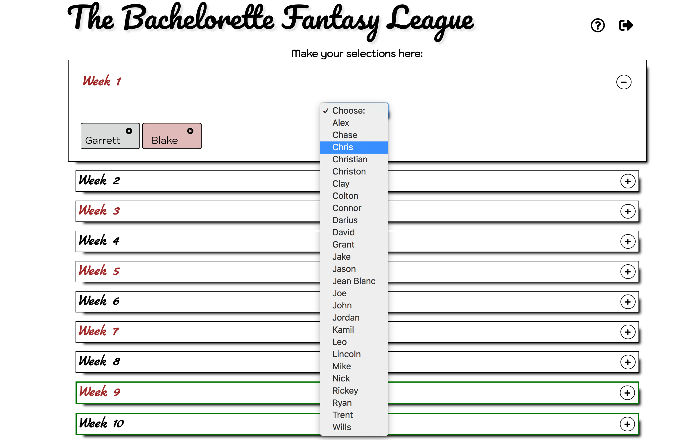
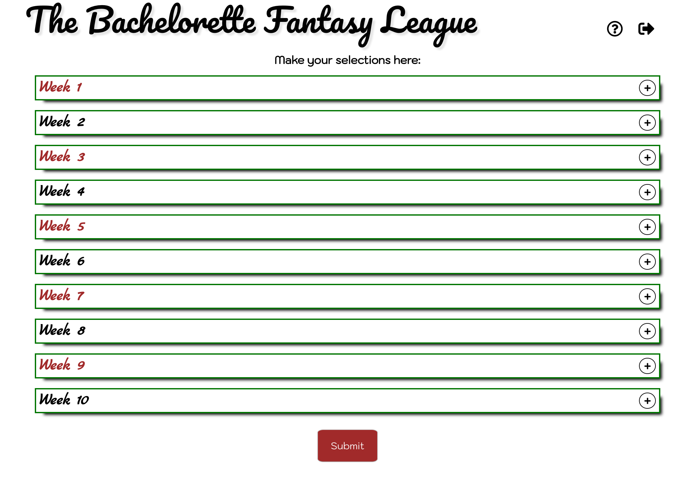
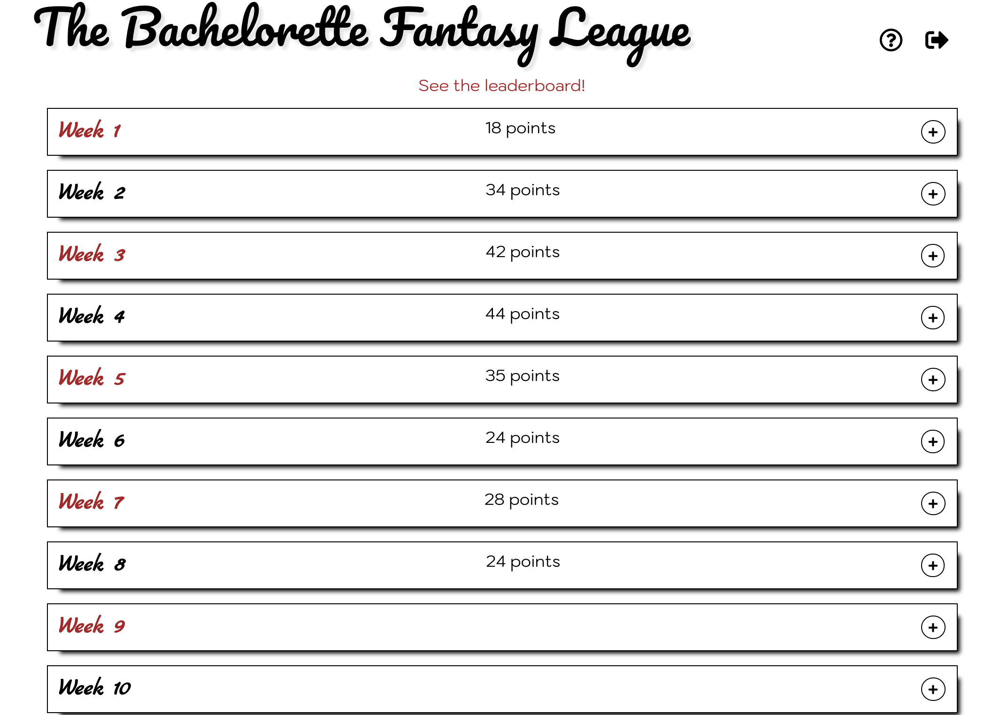
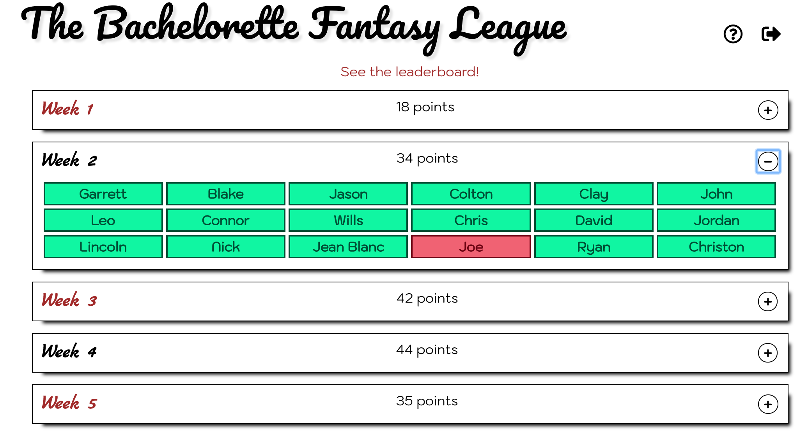
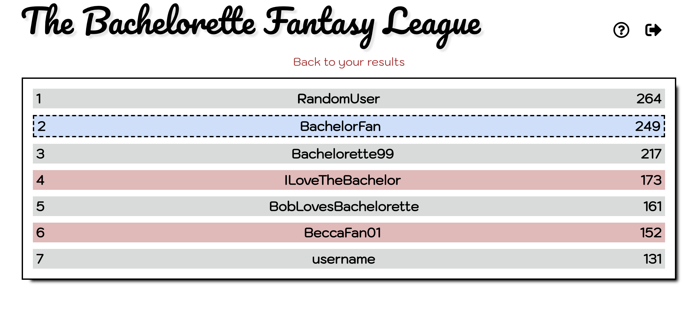

# The Bachelorette Fantasy League App

This project was bootstrapped with [Create React App](https://github.com/facebook/create-react-app).

## Table of Contents

- [App Description](#app-description)
- [Link to deployed version](#deployed-version)
- [Demo user accounts](#demo-accounts)
- [App Screenshots](#app-screenshots)
- [Tech Stack Description](#tech-stack-description)
- [Key Parts in the Codebase](#key-parts-in-the-codebase)
- [Reuse Instructions](#reuse-instructions)

## App Description

This is an app that allows users to make predictions about who will get eliminated each week on the reality show The Bachelorette.

- Users can create an account where they will submit their guesses about which contestants stay each week. 

- After they submit their predictions, they can see the results for each week. They will get points for each correct guess each week, with the points increasing as the week number increases.

- Users will also be able to look at a leaderboard that shows the ranking of all users as of the current week.

- The idea of this app is that the results will update after each episode of the show has aired. For demonstration purposes, all results are given as of week 8. Therefore, users will not have scores or feedback for weeks 9 or 10.

## Deployed App

The deployed version of this app can be found [here](https://cryptic-bayou-79108.herokuapp.com/)

Additionally, here is a link to the [server-side repository](https://github.com/thinkful-ei24/cameron-fullstack-capstone-server)

## Demo Accounts
There are two demo accounts:
- To try out the selection process:
  - username: demoSelection
  - password: password123
- To try out the results page, either submit the above or log in with this account
  - username: demoResults
  - password: password123  

## App Screenshots

**Login Page**

**Info Page**

**Selection Page with Weeks Collapsed**

**Selection Page with Week Expanded**

**Complete Selection Page that's Ready to Submit**

**Results Page with Weeks Collapsed**

**Results Page with Week Expanded**

**Leaderboard**

## Tech Stack Description
The frontend of the app uses React and Redux.

The backend uses Node, Express, and a Mongo database. Passport is used for authentication.

## Key Parts in the Codebase
- The login and signup forms are located in `src/components`, in the Javascript files with the same names.
- The selection form is located in `src/components/WeekHolder.js`.
- The results component is located in `src/components/ResultsHolder.js`.
- The leaderboard component is located in `src/components/Leaderboard.js`.
- The `submitGuesses` async action is located in the `actions/selection-actions.js` file and the corresponding backend endpoint is located in `guesses/router.js`.
- The `getResults` async action is located in `actions.results-actions.js` and the corresponding backend endpoint is located in `results/router.js`.

## Reuse Instructions

In order to reuse this app, the developer should have Node installed. Clone the server and client side repos and run `npm install` on both. 

To update the "results as of" week, in the server-side repo, update the `week` variable in the file `results/router.js`.
